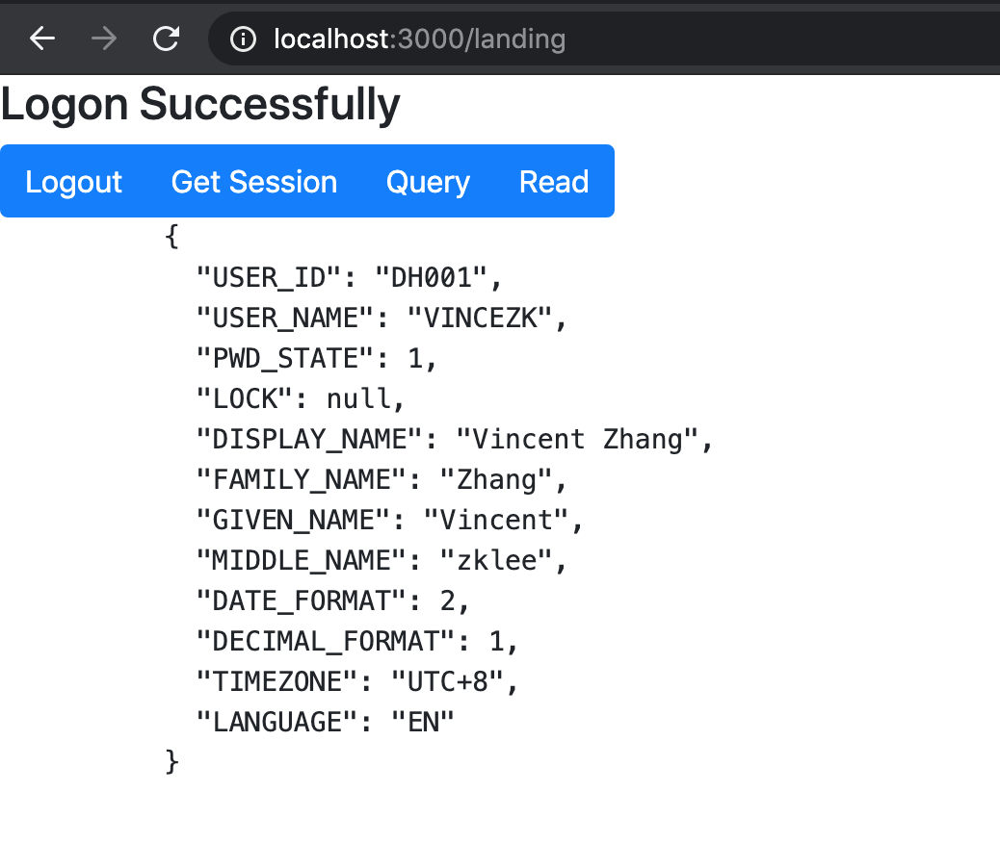
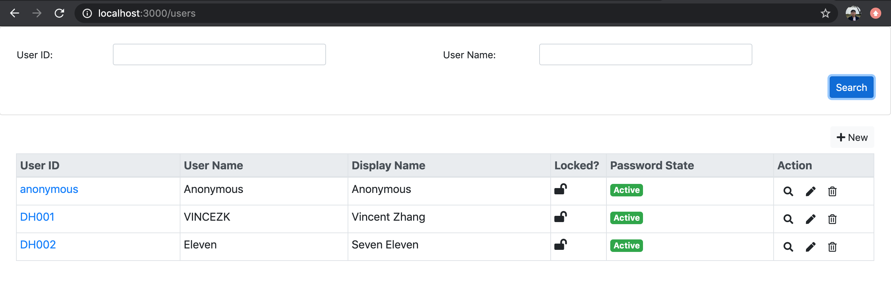
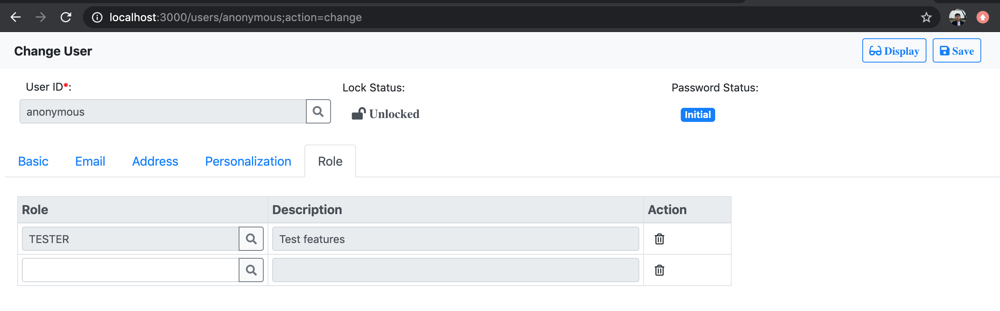
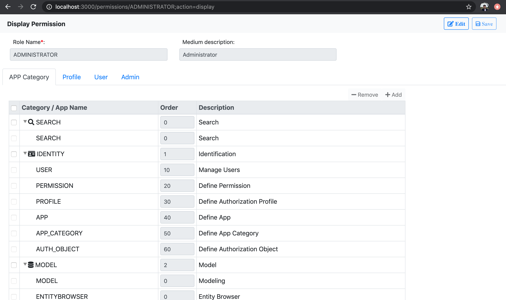
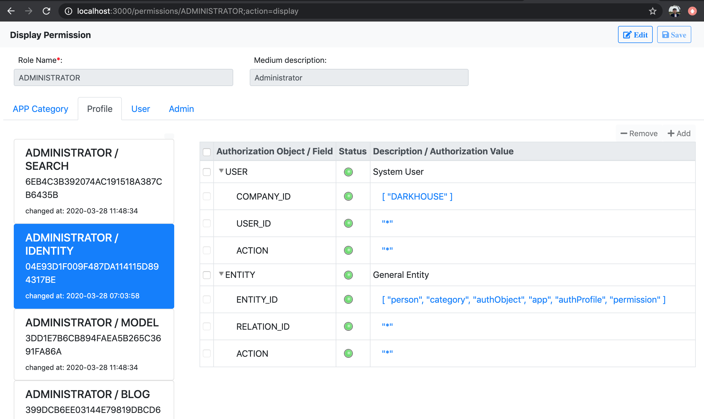
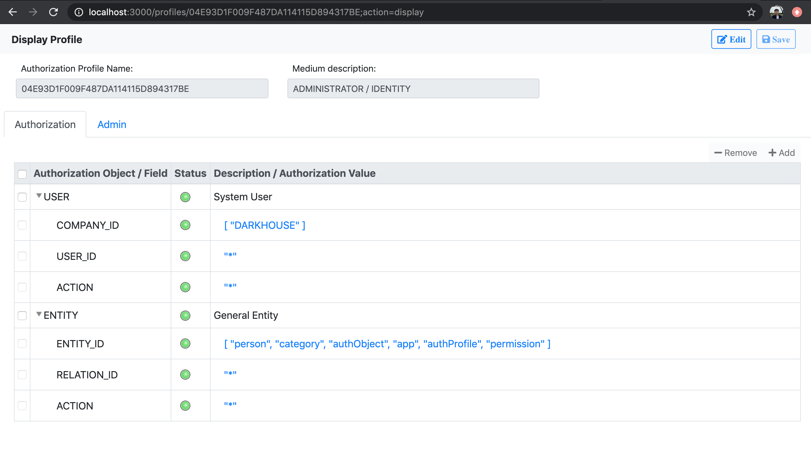
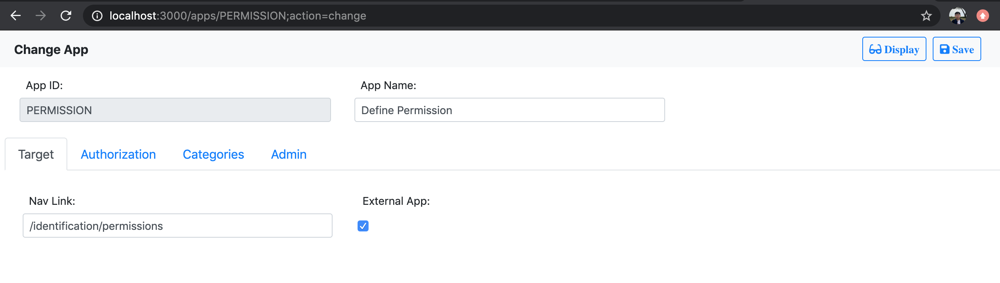
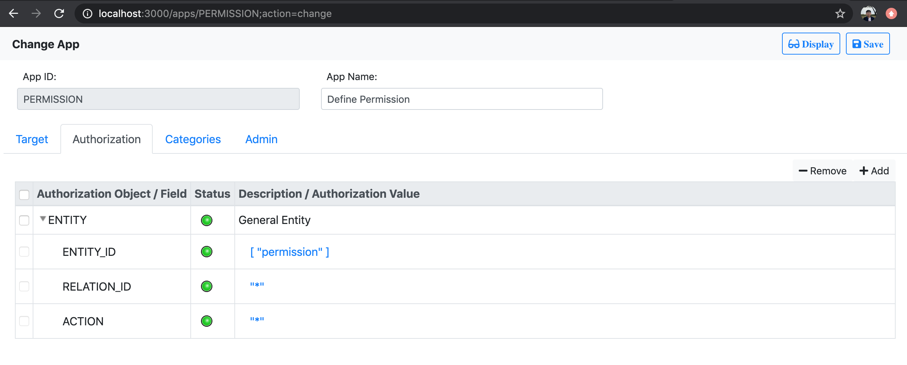
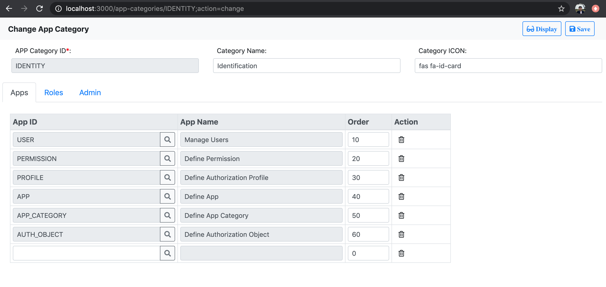
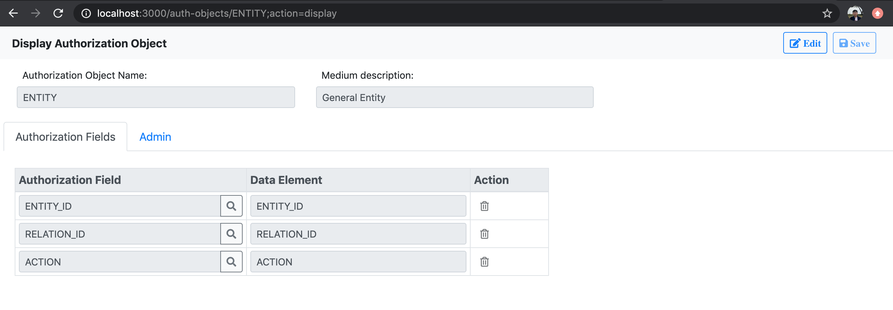

# UI-Logon
An identification management solution implemented using using Angular, Express, Passport, node-authorization, and JSON-On-Relations. 

## How to Use
UI-Logon contains 3 parts: 

1. "ui-logon-angular" is an Angular reusable component. You can use it to compose your logon page. 
2. "Identification Apps" contains various Apps which are used to maintain identification objects. 
You can use these Apps to easily maintain users, permissions, profiles, authorization objects, and so on. 
3. "ui-logon" is a NodeJS component which contains backend routes, authentication, and authorization logic. 

You can leverage the 3 parts separately or in combinations.

## UI-Logon-Angular
1. Install it to your angular project:
   ```bash
    $ npm install ui-logon-angular --save
   ```
2. In "app.module.ts", import the "LogonModule" from "ui-logon-angular":
   ```typescript
   import {LogonModule} from 'ui-logon-angular';

   @NgModule({
     declarations: [
       AppComponent
     ],
     imports: [
       BrowserModule,
       LogonModule
     ],
     providers: [],
     bootstrap: [AppComponent]
   })
   export class AppModule { } 
   ```
3. In "app.component.html", add the "dk-logon" template:
   ```html
   <dk-logon [redirectUrl]="'https://github.com/VinceZK/json-on-relations'"></dk-logon>
   ```
4. Run your Angular project. Hopefully, you will see following UI:   


### Change the Labels
The title and labels in the UI component can be changed. You can either do it in this way:
```html
<dk-logon [title]="My Logon Dialog" [userLabel]="Email" [pwdLabel]="Password" [btnLabel]="Sign In" 
          [redirectUrl]="'http://your-landing-page'">
</dk-logon>
``` 
Or use the navigation data attribute:
```typescript
const appRoutes: Routes = [
  { path: 'landing', component: LandingPageComponent },
  {
    path: 'logon', component: LogonComponent,
    data: {
      title: 'Logon Portal', userLabel: 'User ID', pwdLabel: 'Password', btnLabel: 'Sign In',
      redirectPath: 'landing', redirectUrl: ''
    }
  },
  { path: '**', redirectTo: 'logon', pathMatch: 'full'}
];
```
You can find another difference of the above 2 approaches. The second one uses Angular Route to do the redirection.
Thus you use attribute "redirectPath" instead of "redirectUrl", which will redirect to a Angular component.

## Identification Apps
After git clone this project, following Angular Apps are in the folder `/src/app`:
1. Manage Users  --> `user`
2. Define Permission --> `permission`
3. Define Authorization Profile --> `profile`
4. Define App --> `app`
5. Define App Category --> `app_category`
6. Define Authorization Object --> `auth_object`

You run the command `ng build` in the project root to generate the static runnable in `dist/identification`.
In the NodeJS initiative file `server.js`, you can find following statements are used to expose the runnable 
through [ExpressJS](https://expressjs.com):
``` javascript
const express = require('express');
const app = express();

// Static stuff before session is initialized
const path = require('path');
app.use(express.static(path.join(__dirname, 'dist/identification')));
app.get('/logon', (req, res) => { // Open the logon page
  res.sendFile(path.join(__dirname, 'dist/identification/index.html'));
});
``` 

To run the Apps, you need to install MySQLs(5.6) and [Redis](https://redis.io/topics/quickstart).
You should also refer [JSON-On-Relations](https://github.com/VinceZK/json-on-relations) to populate the data into MySQL instance.

At last, execute comment `npm install` and then `node server.js` to start the server. 
 
### Logon
Access the URL: http://localhost:3000/logon. You use user name 'DH001' and password 'Dark1234' to logon. 


After successfully logon, you can check the session data in the landing page:



### User
Access the URL: http://localhost:3000/users. You can search users using using 'user ID' and 'user name'



You can assign roles(permission) to a user:



### Permission
Access the URL: http://localhost:3000/permissions.
Permission(role) is maintained by first assigning App categories. 


Profiles will be generated per app category. In the profile, you then maintain detail authorizations for each profile: 


### Profile
Access the URL: http://localhost:3000/profiles.
Profiles can be created or maintained directly. This is useful when you want to grant technique users(for background jobs or APIs)
permissions. Because those technique users usually do not need UI access. 


### App
Access the URL: http://localhost:3000/apps.
You can register an App in the system.


And you can also maintain default authorizations for the App, 
so that afterwards, when the App is assigned to a Permission, 
the default authorizations will be brought to the Permission for easy maintenance. 


### App Category
Access the URL: http://localhost:3000/app-categories.
You create App categories to group relative Apps together as an assignment unit. 
When an App category is assigned to a Permission, a corresponding Profile is also created. 


### Authorization Object
Access the URL: http://localhost:3000/auth-objects.
You define authorization object to represent a permission unit.
An authorization object can map to a business object, or an abstract object only for permission control. 
It contains authorization fields to compose the authorization schema and value. 


## UI-Logon
The "ui-logon" is the server end of the identification management. It also leverages following modules:
+ [ExpressJS](https://expressjs.com), 
+ [PassportJS](http://www.passportjs.org/), 
+ [node-authorization](https://github.com/VinceZK/authorization), 
+ [JSON-On-Relations](https://github.com/VinceZK/json-on-relations).
Check the `package.json` for other related modules. 

"ui-logon" uses redis as the session store for PassportJS. So you have to install the redis server. 
Please refer the [quick guide](https://redis.io/topics/quickstart) for how to install redis.

JSON-On-Relations depends on MySql(5.6). Please refer the [How-to-use](https://github.com/VinceZK/json-on-relations)
on JSON-On-Relations on how to populate the data in MDB. 

After get the above prerequisite done. You can now follow the steps below to setup the server:
1. Install it to your node project:
   ```bash
   $ npm install ui-logon --save
   ```
2. Refer `ui-logon\server.js` to create your own entry file in the root of your Node project:

3. Now you can start the node server and test the logon page:      
   ```bash
   $ node server.js
   ```
   Test with the link: <http://localhost:3000>

### Define Logon Strategy
PassportJS already provides a flexible way to let use different authentication strategies. 
Since we mainly use the basic user&password strategy, so just register a LocalStrategy is enough.
The default implementation is given in `ui-logon/server/Authentication.js`:

It uses JSON-On-Relations(jor.Entity) to retrieve user information from the database. 
The function "getInstancePieceByID" is called to ask for the information from relation "r_user" 
with USER_ID equals to the requested username. Please refer <https://github.com/VinceZK/json-on-relations> for the API details.

After the user information is retrieved, it compares the password values. 
If they are equal, then attach the user information to the "identity" object. 
Besides the basic user information, the "identity" is also attached with authorization derived from the assigned permission. 
It is then use [node-authorization](https://github.com/VinceZK/authorization) to utilize authorization checks. 

You can write your own logon logic, and register it with "passport.use()" function, which will overwrite the default.
 
### The Default Routes
The default router is already registered with following routes. 
You can further append your routes to it. 
However, these routes will be protected by "Auth.ensureAuthenticated" 
if it starts with '/api/' to prohibit the unauthorized accesses.
```javascript
// Basic login with username & password
router.post('/api/logon', Auth.logon);
router.delete('/api/logout', Auth.logout);

// Ensure all the APIs bellow are under authentication.
router.all('/api/*', Auth.ensureAuthenticated);

// Identity APIs
router.get('/api/session', Auth.session);
router.post('/api/renewPWD',Auth.renewPWD);

module.exports = router;
``` 

## License
[The MIT License](http://opensource.org/licenses/MIT)
